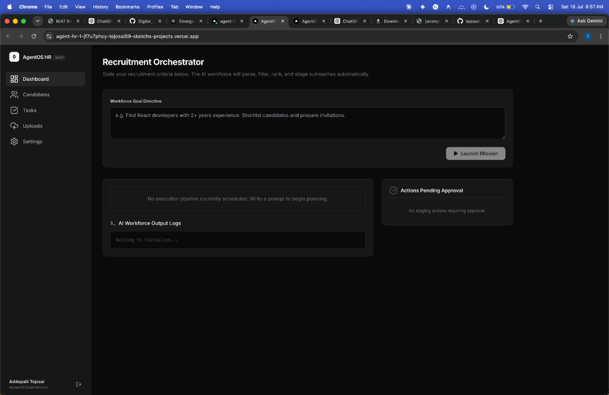
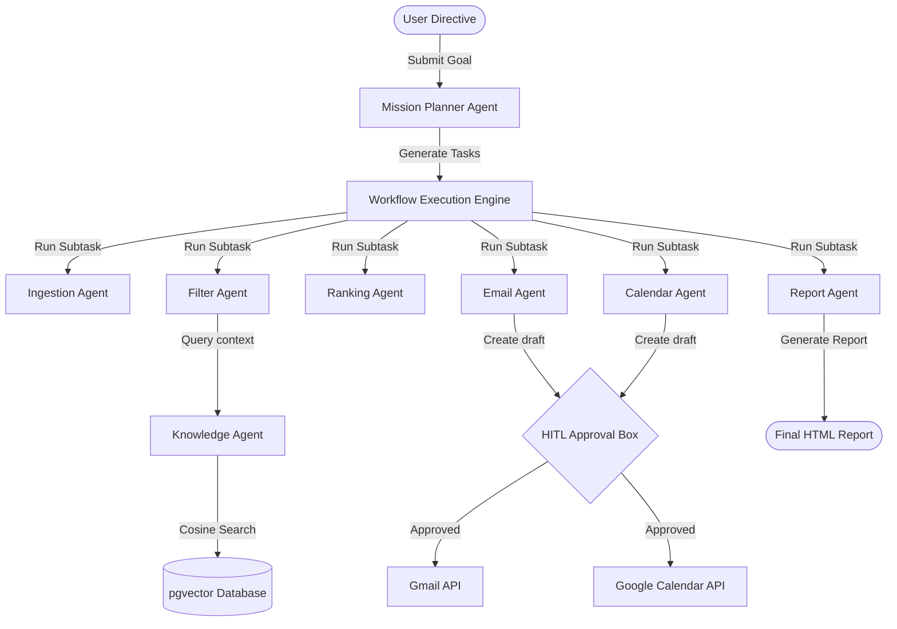
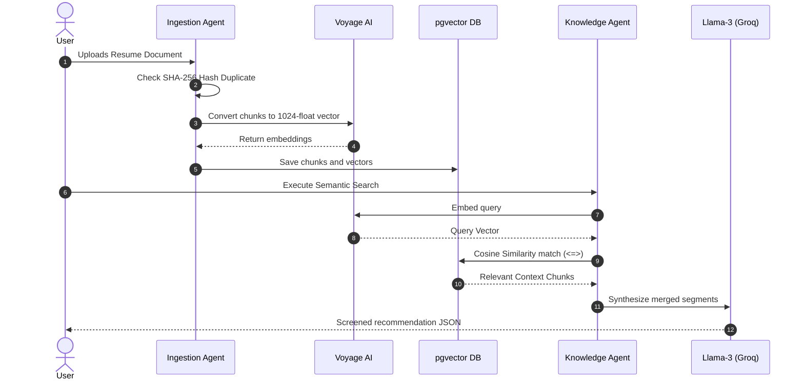
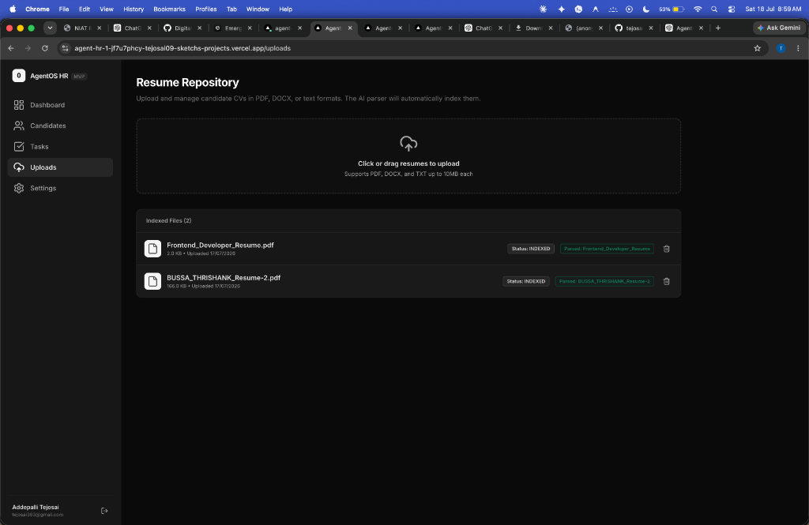
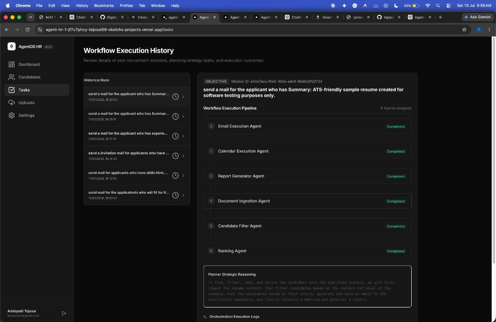
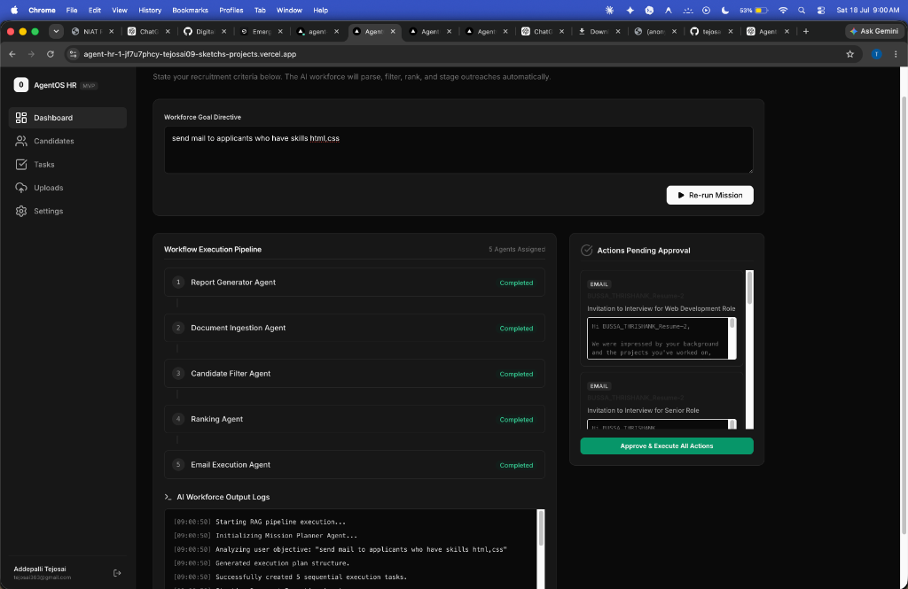

<p align="center">
  
</p>

<h1 align="center">🚀 AgentOS</h1>

<p align="center">
  <strong>Autonomous AI Workforce for Business Workflow Automation</strong>
</p>

<p align="center">
  <em>"Transform natural language directives into autonomous business workflows using RAG pipelines and cooperative AI Agents."</em>
</p>

<p align="center">
  
  
  
  
  
  
  
  
  
  
</p>

---

## 📖 Table of Contents
*   [Overview](#-overview)
*   [Manual vs AgentOS](#-manual-vs-agentos)
*   [Key Features](#-key-features)
*   [System Architecture](#-system-architecture)
*   [RAG Pipeline Architecture](#-rag-pipeline-architecture)
*   [Workflow Execution Timeline](#-workflow-execution-timeline)
*   [Application Interface (Screenshots)](#-application-interface-screenshots)
*   [Project Structure](#-project-structure)
*   [Tech Stack](#-tech-stack)
*   [Installation & Setup](#-installation--setup)
*   [Environment Variables](#-environment-variables)
*   [Example Prompt Directives](#-example-prompt-directives)
*   [Roadmap](#-roadmap)
*   [Contributing](#-contributing)
*   [License](#-license)
*   [Authors](#-authors)

---

## 🌟 Overview
*   **The Problem**: Traditional AI models are simple chat assistants. They answer questions but cannot coordinate or execute workflows across external services (email, calendars, DBs).
*   **The Solution**: AgentOS deploys an orchestrator that plans candidate searches, reads from document chunks, ranks matches, schedules calendars, and dispatches templates.
*   **The Impact**: Transforms multi-hour operations into a single natural language directive, backed by human-in-the-loop approvals.

---

## 📊 Manual vs AgentOS

| Process Phase | Manual Recruitment | Existing AI Chatbots | AgentOS Autonomous Workflow |
| :--- | :--- | :--- | :--- |
| **Ingestion** | Open resume files one by one | Parse text pasted in chat limits | Automatic chunking & `pgvector` indexing |
| **Filtering** | Keyword scan by recruiters | Suggest candidate profiles only | Semantic context search via Voyage AI |
| **Ranking** | Guess fit based on experience | Draft screening questions | Unified scoring (0-100) on Prisma |
| **Outreach** | Draft & email each applicant | Write template text to copy | Stages emails inside human approval box |
| **Calendars** | Coordinate times manually | Recommend scheduling steps | Generates calendar slot invites & Meet links |

---

## ⚡ Key Features
*   📄 **Resume Parsing**: Decodes text formats and validates duplicate files via SHA-256 hashing.
*   🧠 **RAG Knowledge Base**: Uses pgvector & Voyage AI `voyage-3` to index document chunks securely.
*   🤖 **Multi-Agent AI**: Mission Planner, Knowledge, Ingestion, Filter, Ranking, Email, Calendar, and Report agents.
*   🔒 **Human Approval Layer**: Stages generated outreaches so no emails/invitations are sent without confirmation.
*   📈 **Explainable Logs**: Every execution records its cognitive steps in real-time logs on the dashboard.

---

## 📐 System Architecture



---

## 🔍 RAG Pipeline Architecture



---

## 🏁 Workflow Execution Timeline
```
[Upload Resume] ➔ [Index Chunks] ➔ [Submit Prompt] ➔ [Plan Stages] ➔ [Score Matches] ➔ [Review Outreach] ➔ [Book Meet]
```

---

## 📱 Application Interface (Screenshots)

### Dashboard Control Panel

*Recruitment orchestrator directive prompt input and pending task approval box.*

### Resume Repository Uploads

*Resume drag-and-drop ingestion page showing indexed parsing statuses.*

### Execution Planner History

*Mission Planner strategic task breakdowns showing completed workflow runs.*

### Multi-Agent Actions Executing

*Live AI Workforce console logs showing email outreaches staged for review.*

---

## 📂 Project Structure

```
AgentOS/
├── apps/
│   ├── frontend/         # React components, styles, Next.js page views
│   └── backend/          # REST route handlers, AI Agents, database clients
├── database/
│   └── prisma/           # Schema configurations & migrations
├── docs/                 # Systems guides (Architecture, API, RAG Pipeline)
└── assets/               # Screenshots and UI media captures
```

---

## 🛠️ Tech Stack

| Component | Technology |
| :--- | :--- |
| **Frontend** | React 18, Next.js (App Router), Tailwind CSS |
| **Backend** | Next.js Server Actions & Endpoint Routers |
| **Database** | Supabase (PostgreSQL) |
| **Vector Engine** | `pgvector` |
| **Embeddings** | Voyage AI (`voyage-3`) |
| **AI LLM** | Groq (`llama-3.3-70b-versatile`) |
| **ORM** | Prisma v7 |
| **API Connectors** | Google Gmail API, Google Calendar API |

---

## ⚡ Installation & Setup

1. **Clone the Repository**
   ```bash
   git clone https://github.com/bussathrishank595-star/Autonomous-AI-Workforce-for-Business-Workflow-Automation.git
   cd Autonomous-AI-Workforce-for-Business-Workflow-Automation
   ```
2. **Install Dependencies**
   ```bash
   npm install
   ```
3. **Configure Database Schema**
   ```bash
   npx prisma db push
   npx prisma generate
   ```
4. **Launch Local Server**
   ```bash
   npm run dev
   ```

---

## 🔑 Environment Variables
Create a `.env` file in the project root:

| Key | Purpose | Required |
| :--- | :--- | :--- |
| `DATABASE_URL` | Supabase Postgres Pooler connection URI | Yes |
| `GROQ_API_KEY` | Groq cloud credential API key | Yes |
| `VOYAGE_API_KEY` | Voyage AI vector embedding extraction key | Yes |
| `NEXTAUTH_SECRET` | Secret key used to sign NextAuth session JWT tokens | Yes |
| `NEXTAUTH_URL` | Base application location URL | Yes |
| `GOOGLE_CLIENT_ID` | OAuth API Client ID credential | Yes |
| `GOOGLE_CLIENT_SECRET` | OAuth API Secret credential | Yes |

---

## 💡 Example Prompt Directives
*   `find React developers with 3 years of experience. Shortlist them and send invitations.`
*   `shortlist candidates with Python skills, schedule interviews, and compile a status report.`

---

## 🗺️ Roadmap
*   ☑ **pgvector Similarity Search**
*   ☑ **Automatic Resume parsing**
*   ☑ **Candidate matching scores**
*   ☑ **Gmail & Google Calendar integrations**
*   ☐ **Slack notifications integration**
*   ☐ **CRM Salesforce integrations**
*   ☐ **Voice command inputs**

---

## 📄 License
This project is licensed under the MIT License - see the [LICENSE](LICENSE) file for details.

---

## 👥 Authors
- **Tejosai** - [GitHub](https://github.com/tejosai09-sketch)
- **Thrishank** - [GitHub](https://github.com/bussathrishank595-star)
